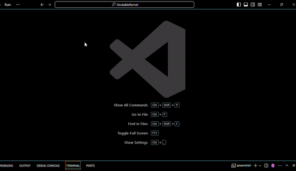

<h1> Enviorment Setup </h1>
<h2>MSYS2 Install / Download</h2>

1. Visit the MSYS2 download page at https://www.msys2.org/
2. Download and Run the installer.

<h2>MSYS2 Install Packages</h2>
<h3>NASM</h3>

Use the 'pacman' command to install the nasm package: ``pacman -S mingw-w64-ucrt-x86_64-nasm``

<h3>CLANG</h3>

Use the 'pacman' command to install the clang package: ``pacman -S mingw-w64-ucrt-x86_64-clang-15``

<h3>LLVM LLD</h3>

Use the 'pacman' command to install the llvm linker package: ``pacman -S mingw-w64-ucrt-x86_64-lld``

<h1> Visual Studio Code Setup </h1>
<h2>Terminal Setup</h2>

1. Open a terminal, then next to the + symbol, click the drop down, and select default profile.

2. Then, there should be a 'detected' terminal profile, ex: bash (MSYS2); and select bash (MSYS2) option.
3. Now, you can go back to select default profile and set it back to it's default if wanted.